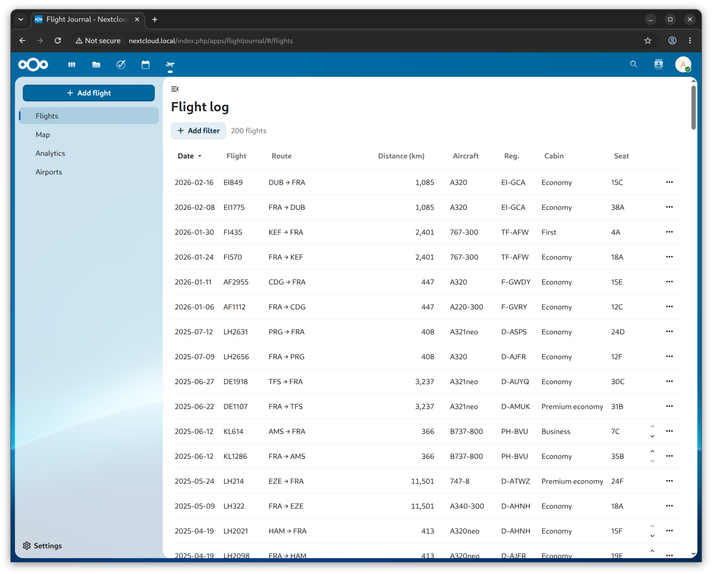
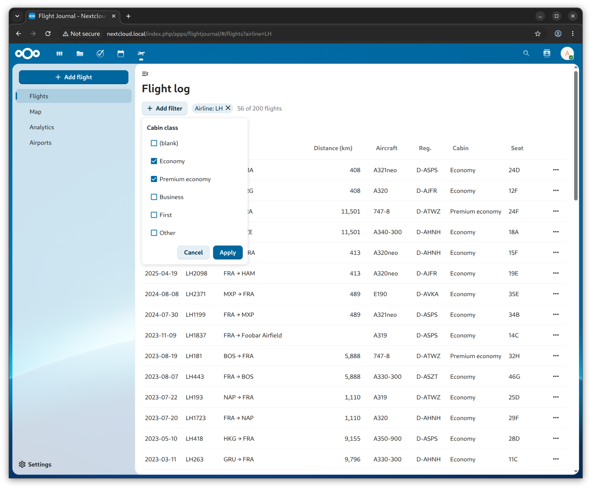
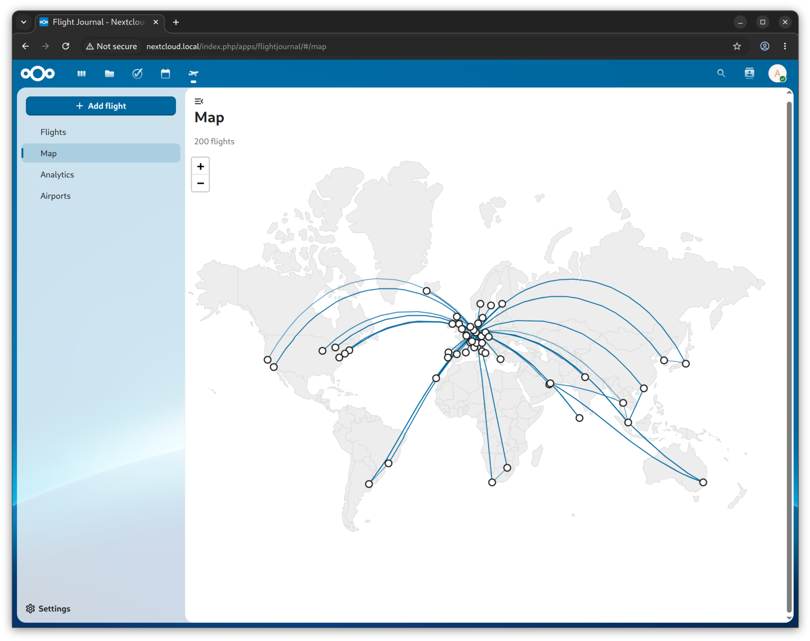
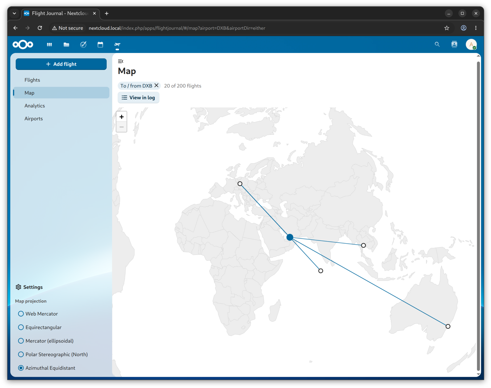
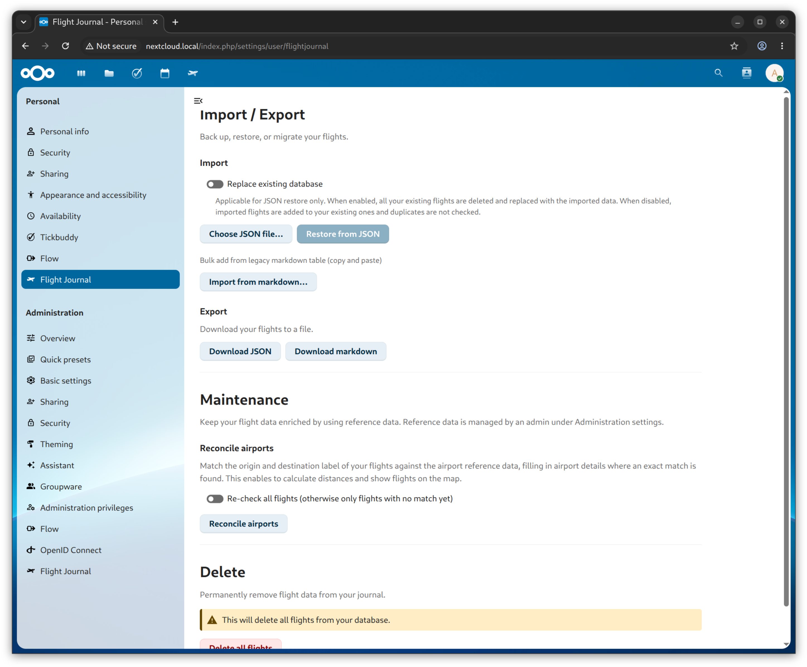

# Flight Journal

A personal Nextcloud app project for tracking flights that I have travelled on.

### Motivation

This is a personal hobby project which I am using to learn about Nextcloud app development and AI-assisted development. Significant portion of the code has been written by Claude Code.

### Found a bug?

Feel free to get in touch and/or submit an issue.

### Screenshots

Flights screen

Flights screen with filters 

Map screen

Map screen filtered for specific airport and using the  azimuthal equidistant projection

Settings screen

