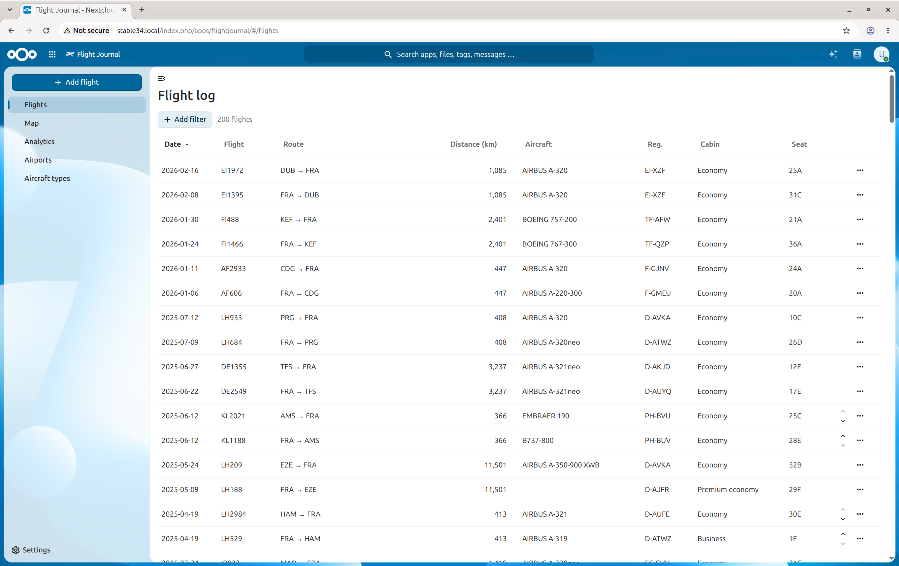
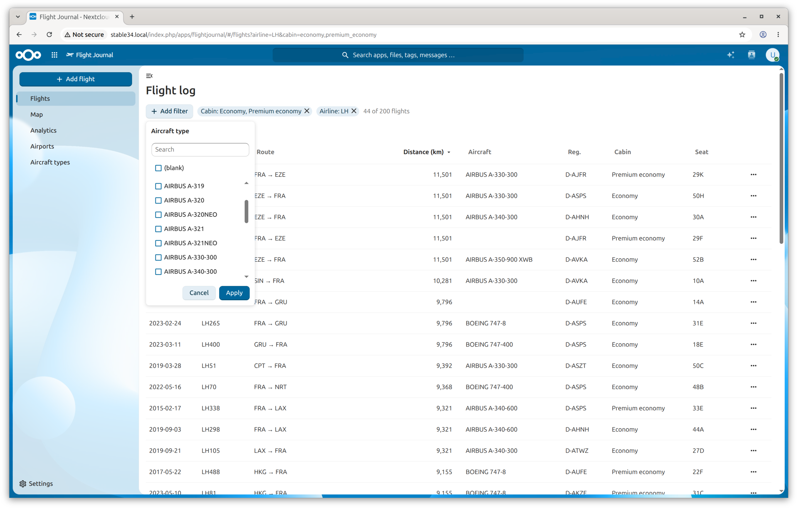
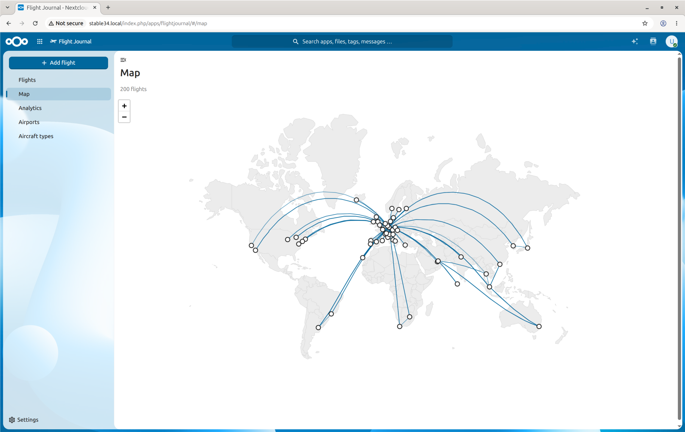
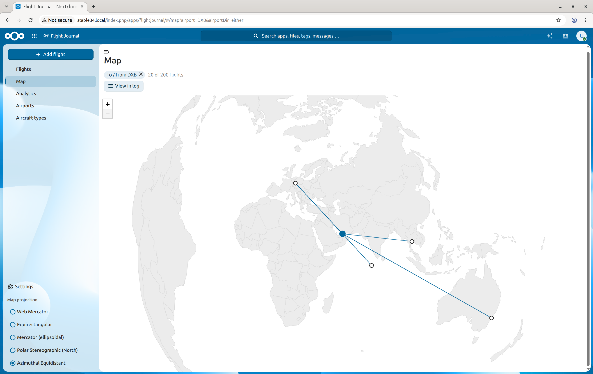
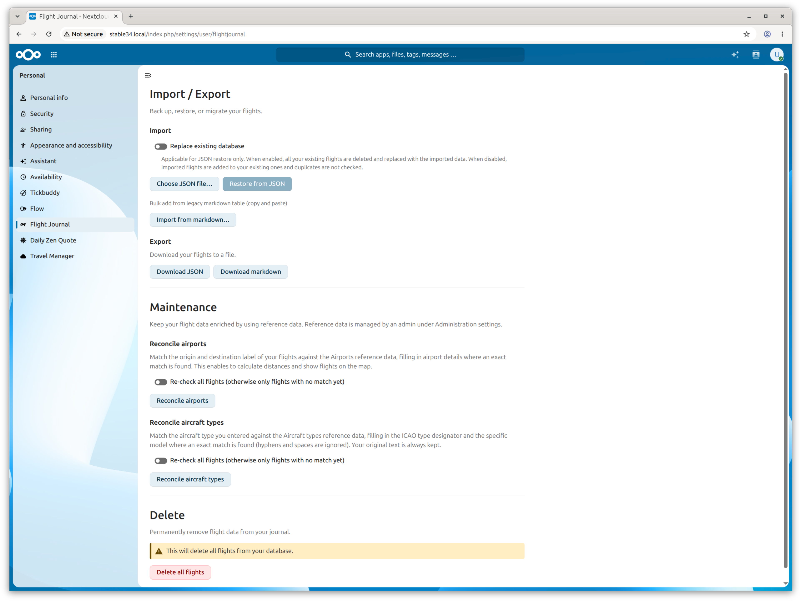
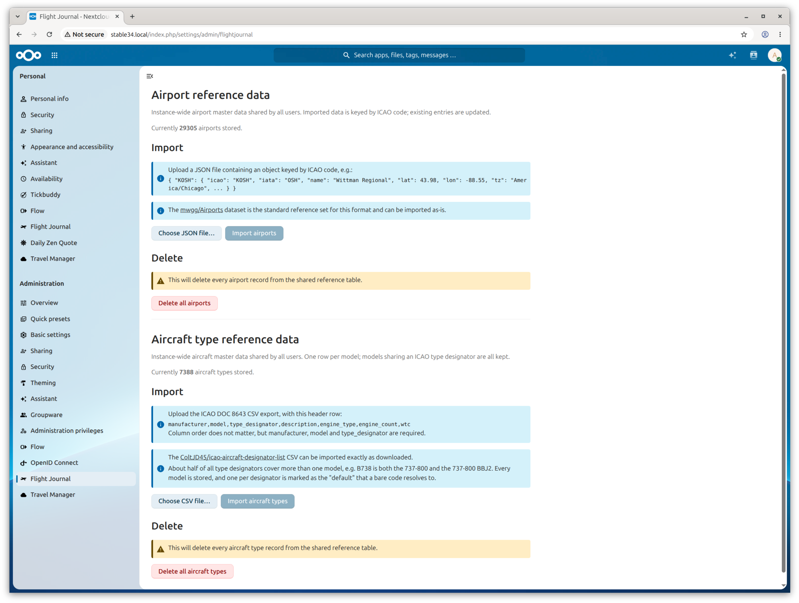

# Flight Journal

A personal Nextcloud app project for tracking flights that I have traveled on.

The app is a flight log for the frequent traveler, keeping track of flights with details such as origin, destination, airline, flight number, aircraft type etc. This data can be visualized on a map and various statistics and insights can be generated.

Key features:
* Flights screen to add, view, and manage your flight log entries
* The Flights screen supports various filters and sorting
* Admin Settings screen which allows import of airport and aircraft reference data sets
* Personal Settings screen with bulk import/export, bulk delete and reconciliation (enrichment) against reference data sets
* Map view showing your flights on a map (depends on airport reference data with geo coordinates) - different projections are supported
* Great circle distance is calculated (depends on airport reference data with geo coordinates)
* Applied filters propagate between the Flights and Map screens
* Airports and Aircraft types screens
* Demo data set which can be used for experimentation

Future roadmap:
* Bulk updates for selected attributes (e.g. aircraft type, cabin class)
* Analytics screen with cool statistics and visualizations
* Localization
* Further reference data enrichment
* ...and more!

The app is currently not published on Nextcloud app store. This might change once it reaches a certain level of feature-completeness AND if there is any interest or value in publishing it.

Credit to the canonical reference data sets supported by the application:
* Airports: [mwgg/Airports](https://github.com/mwgg/Airports)
* Aircraft types: [ColtJD45/icao-aircraft-designator-list](https://github.com/ColtJD45/icao-aircraft-designator-list)

### Motivation

This is a personal hobby project. I have been keeping a log of all my flights for around 10 years and I have an interest in software development, data analysis and visualization. I am using this project to learn about Nextcloud app development and AI-assisted development. Significant portion of the code has been written by Claude Code.

### Find this useful? Have a suggestion? Found a bug?

Feel free to get in touch and/or submit an issue.

### Screenshots

Flights screen

Flights screen with filters and sort applied and filter dialog open 

Map screen

Map screen filtered for specific airport and using the azimuthal equidistant projection

Personal Settings screen

Admin Settings screen

